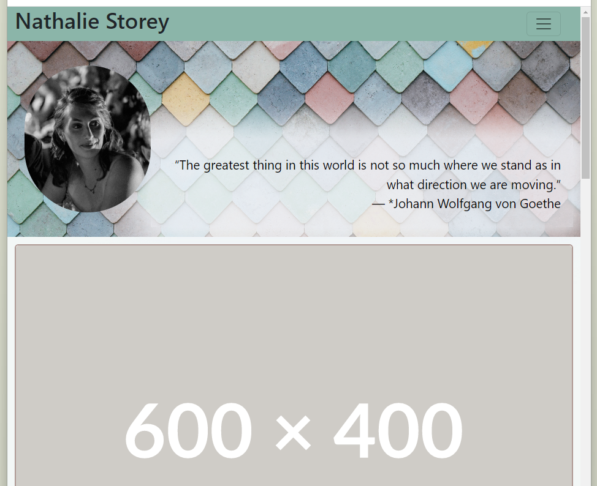
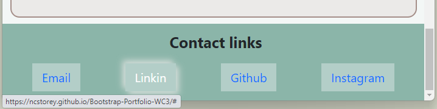

# Bootstrap-Portfolio-WC3
My portfolio built using Bootstrap 5 for skills bootcamp weekly challenge 3
## Description

This project was undertaken in 2023 in response to the skills bootcamp weekly challenge 3. 

We were tasked with remaking our portfolio using Bootstrap 5 elements.

There were multiple features that the portfolio had to include
- A navigation bar with jump links
- Jumbotron with a picture of ourselves
- Bootstrap cards to display future projects
- A skills section
- A footer section with hover hyperlinks and hover box shadows
- Responsive to screen size with minimal media queries

Other than this we were allowed to style as we wished.

*screen shot of nav bar collapsed*

*screen shot of footer with box shadow hover*

## Installation

The repo contains basic file types (html, css, png) and requires no special installations.
## Usage

This page is to first be used by the graders at Trilogy Education to asses my grade.

Secondly to be used by future employers to see my journey and the progress I am making.

## Credits

This Project was done under the guidance of Trilogy Education for their skills for life bootcamp course.

The photo in my jumbotron is from Unsplash. Photographer: Andrew Ridley

- Photo by <a href="https://unsplash.com/@aridley88?utm_source=unsplash&utm_medium=referral&utm_content=creditCopyText">Andrew Ridley</a> on <a href="https://unsplash.com/photos/jR4Zf-riEjI?utm_source=unsplash&utm_medium=referral&utm_content=creditCopyText">Unsplash</a>
  

## License

Please refer to the repo for information about the license.

## Future work

In the interests of time I halted the project here. In the future I would want to add the following
- Project cards are links to my other projects
- Skills section has hoover effects to show icons, progress bars for the technical skills